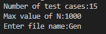
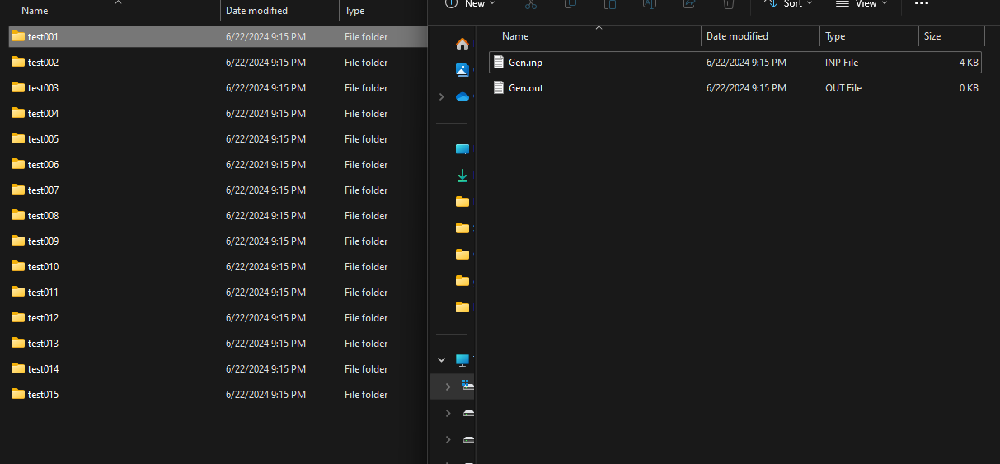
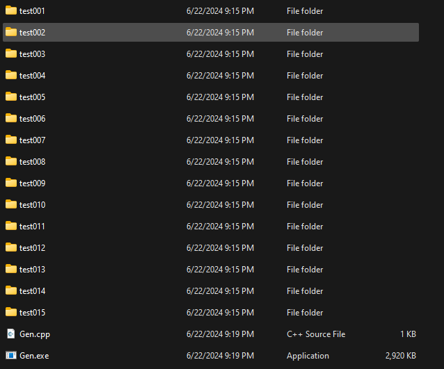
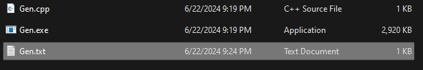
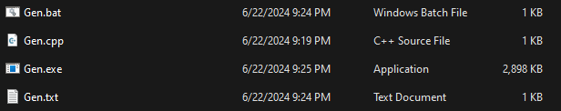
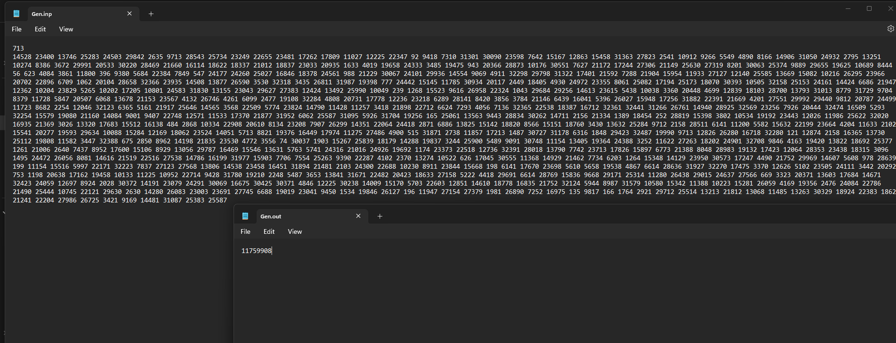

# GenTest

**English description down below!**

Đây là một repo nho nhỏ có thể giúp các bạn sinh test cho Lập trình thi đấu, với khả năng có thể thay đổi số lượng bộ test và độ lớn của số.

Toàn bộ file sinh test đều được viết bằng ngôn ngữ **C++**.

## Các file sinh test

Các file này đều sinh ra các file .inp và chưa có đáp án ở file .out (Vì một số trường hợp các bạn chưa cần đến file .out). Tuy nhiên, mình đã có sẵn hai file **create_output_by_using_cpp_solution.txt** và **create_output_by_using_python_solution.txt** để có thể giúp các bạn điền các file .out với việc sử dụng code giải thuật của bài toán để sinh ra output. Tuy nhiên, các bạn sẽ phải đặt tên file này chung với các file test00x, đặt cùng tên với các file `.inp` và `.out`. Mình khuyên các bạn nên đặt cùng là "folder_name" (Với "folder_name" các bạn set up là gì cũng được), qua đó thay đổi tên file `.txt `thành đuôi `.bat`, cuối cùng là chạy file `.bat` để điền vào các file `.out`. Ở cuối mình sẽ có ví dụ để các bạn dễ hiểu hơn.

### 1. testgenarray.cpp

Ở file này, mình đang để sinh ra các test cơ bản nhất với một mảng gồm N số.

### 2. testgennumber.cpp

Ở file này, mình đang để sinh ra các test với một số N. Tuy nhiên có thể biến đổi theo yêu cầu của bạn hoặc đề bài.

### 3. testgenstring.cpp

Ở file này, mình đang để sinh ra một chuỗi kí tự bất kì với độ dài N. Bạn có thể biến tấu bất kì.

### 4. testgeninp.cpp

Mình để file này ở đây để các bạn có thể biến tấu, viết thuật toán phù hợp để sinh ra các bộ test phù hợp với yêu cầu của bạn hoặc phù hợp với yêu cầu đề bài.

Sau đây, để giúp các bạn dễ hình dung, mình sẽ làm mẫu việc sinh test cho bài toán:

- Cho một mảng gồn N số.
- Tính tổng các số trong mảng N.

**Bước 1: chạy file testgenarray để sinh ra bộ test gồm số N và một mảng gồm N số.**

Mình sẽ sinh ra một bộ test tên là `Gen`, số lượng testcases là `15`, giá trị lớn nhất của N là `1000`.

Ta có thể thấy với mỗi file test00x, trong đó có 2 file, gồm `Gen.inp` để chứa input và `Gen.out` để chứa đáp án bài toán.

**Bước 2: tạo file cpp là lời giải bài toán, đặt tên cùng với các file `.inp` và .`out`.**

Tạo `Gen.cpp` là lời giải của bài toán - tính tổng N số của mảng.

**Bước 3: tạo file `.txt` là code để chạy file lời giải, điền đáp án vào các file `.out`**

Tùy vào file lời giải của bạn là python hay cpp tương ứng, ta lấy code ở **create_output_by_using_cpp_solution.txt** hoặc **create_output_by_using_python_solution.txt**, copy vào một file `.txt` và đặt tên y hệt các file `.inp`.

**Bước 4: Đổi đuôi `.txt` thành đuôi `.bat`, sau đó chạy file đó.**

Và ta có thể thấy các file `.out` đã được điền đáp án!

**Lưu ý:** File name của các file input, file code solution và file bat ***phải*** giống nhau.

Mong rằng repo này sẽ giúp các bạn có thể sinh test một cách dễ dàng và hiệu quả.

# English description

Here is a small repository that can help you generate tests for Competitive Programming, with the ability to change the number of test cases and the size of the numbers.

All the test generation files are written in **C++**.

## Test Generation Files

These files generate .inp files and do not include answers in the .out files (since in some cases, you may not need the .out files). However, I have provided two files, **create_output_by_using_cpp_solution.txt** and **create_output_by_using_python_solution.txt**, to help you fill in the .out files using the algorithm code for the problem to generate the output. You will need to name these files the same as the test files (e.g., test00x) and place them in the same folder with the .inp and .out files. I recommend placing them all in a folder named "folder_name" (where "folder_name" can be anything you set up), then change the .txt file extension to .bat, and finally, run the .bat file to fill in the .out files. I will provide an example at the end for better understanding.

### 1. testgenarray.cpp

This file generates the most basic tests with an array of N numbers.

### 2. testgennumber.cpp

This file generates tests with a number N. However, it can be modified according to your requirements or the problem statement.

### 3. testgenstring.cpp

This file generates a random string of characters with length N. You can customize it as needed.

### 4. testgeninp.cpp

This file is included so you can customize it and write an appropriate algorithm to generate test cases according to your needs or the problem requirements.

To help you visualize, I will provide an example of generating tests for the following problem:

- Given an array of N numbers.
- Calculate the sum of the numbers in the array N.

**Step 1: Run the testgenarray file to generate a test set with the number N and an array of N numbers.**

I will generate a test set named `Gen`, with 15 test cases, and the maximum value of N is 1000.

We can see that for each test00x file, there are two files: `Gen.inp` to contain the input and `Gen.out` to contain the problem's solution.

**Step 2: Create a cpp file as the solution to the problem, named the same as the .inp and .out files.**

Create `Gen.cpp` as the solution to the problem - calculating the sum of N numbers in the array.

**Step 3: Create a .txt file with code to run the solution file and fill in the answers in the .out files.**

Depending on whether your solution file is in Python or C++, use the code from **create_output_by_using_cpp_solution.txt** or **create_output_by_using_python_solution.txt**, copy it into a .txt file, and name it the same as the .inp files.

**Step 4: Change the .txt file extension to .bat, then run that file.**

We can see that the .out files have been filled with the answers!

**Note:** The filenames of the input files, solution code file, and bat file ***must*** be the same.

I hope this repository helps you generate tests easily and effectively.
